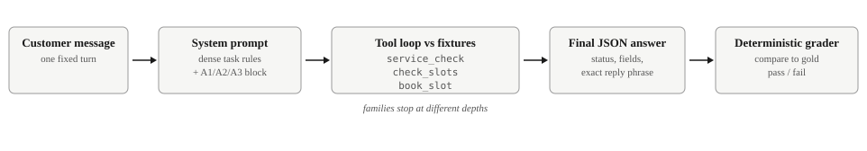
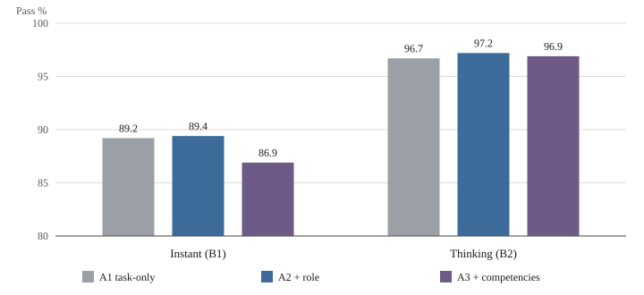
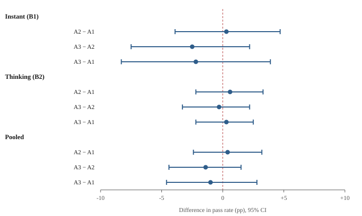
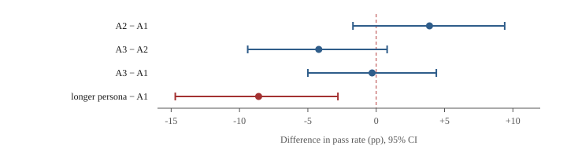

# Skip the Roleplay

### Persona prompting did not improve a real-world AI agent

**Ihor Parinov (TARK AI)** · [ORCID 0009-0006-9411-8633](https://orcid.org/0009-0006-9411-8633) · Preprint v1.1 · August 2026

## Abstract

Production agents that book jobs and call tools often start with a role line ("you are a scheduling agent") and a sentence of generic professional virtues. The rest of the prompt is usually already a long, correct task policy plus strict tool and output schemas. We tested whether those extra identity lines change how often the agent fully completes the job.

The exam is appliance-repair scheduling. Each case is one messy customer message, simulated tools, and a gold answer. The agent passes only if the required tool calls, arguments, extracted fields, and (when required) the exact customer reply all match gold. A paraphrase or a near-miss is a fail.

We ran OpenAI `gpt-5.6-luna` on 120 frozen cases. Prompt styles: task instructions only (A1); the same plus a short role line (A2); the same plus that role line and one generic competency sentence (A3). API modes: instant (`reasoning.effort=none`) and thinking (`reasoning.effort=medium`). Three repeats. 2160 graded attempts, 0 technical API failures. This is the short line people paste onto an already specified agent, not Kong-style role-play on reasoning benchmarks and not ExpertPrompting-style expert biographies.

Under the locked rule (case-level paired bootstrap 95% CI must exclude 0), none of A2−A1, A3−A2, or A3−A1 cleared that bar in instant, in thinking, or pooled. Short role and generic competencies did not show a clear help or clear harm **in this setup**. Pass rates are high, especially with thinking on, so a tiny true effect could still hide. Thinking beat instant by **+8.4 pp** (96.9% vs 88.5%). The title is about the role line, not that mode gap.

**Limits.** A3 is one generic sentence, not domain coaching. Pass/fail is all-or-nothing. One confirmatory model, one domain.

## 1. Introduction

### Motivation

A common piece of prompting advice is to cast the model as an expert: "you are a helpful scheduling agent," sometimes followed by a short list of professional virtues. That advice is familiar in chat. It is also still common in agents that call tools to book real jobs. Those product prompts already contain a long task policy, tool schemas, and an output contract. Whether a short role line, or a generic competency sentence on top, then changes how often the agent fully completes the job is less clear than the advice implies.

That is worth measuring. If the extra identity text rarely clears a pre-set statistical bar once the task rules are locked, people who ship these agents can stop treating it as a primary lever and spend time on the rules, the evaluation, and (where the API offers it) reasoning effort. If it does help or hurt under a locked design, that is worth knowing too.

We test this on an appliance-repair scheduling exam: simulated tools, Structured Outputs, and a deterministic grader. No LLM-as-judge for pass/fail. The confirmatory model is OpenAI `gpt-5.6-luna`. The primary contrast is short role / generic competencies versus task-only. Instant versus thinking is secondary. Related work on Kong-style role-play and ExpertPrompting biographies is a different intervention; we return to that in Discussion.

---

### Contributions

1. **A confirmatory, protocol-locked null on short role / generic competency text** in this tool-using scheduling exam on `gpt-5.6-luna` (*N* = 2160 graded attempts). Under a pre-set case-level paired bootstrap rule, none of the primary prompt-style contrasts meet the threshold for clear help or clear harm on full-case pass **in this setup**.

2. **A secondary mode result.** Medium reasoning effort lifts full-pass rates versus instant (+8.4 pp overall). Asking the model to think changes outcomes here. The short identity line does not.

3. **Appendix follow-ups.** A3 is one generic sentence, not domain coaching. Longer-persona and other-model checks stay in the appendix and do not rewrite the Luna claim.

## 2. Related work

Short role lines (“you are a scheduling agent”) and soft competency text remain standard practice in production agents. Prior literature shows that persona and instruction effects are real in some settings and null in others, but almost always on QA, reasoning, or open-ended writing, not on dense tool-using instruction stacks with deterministic business gold. We situate our confirmatory study in four strands.

### Role and persona prompting

Persona / role prompting is a crowded area, now surveyed as LLM *role-playing* (assigning a persona to the model) versus *personalization* (conditioning on a user persona) [Tseng et al., 2024; Chen et al., 2024]. Early positive results encouraged the folklore: Kong et al. [2024] report that strategically designed role-play prompting improves zero-shot reasoning over standard prompting on most of twelve benchmarks (e.g., AQuA 53.5%→63.8% with ChatGPT), acting as an implicit chain-of-thought trigger. Xu et al. [2023] (*ExpertPrompting*) show that detailed, auto-synthesized expert biographies, often tailored per instruction, can raise judged answer quality and support stronger instruction-tuned assistants. That is a different intervention from the short “you are a scheduling agent” line practitioners add on top of an already dense task stack (our A2/A3). These gains are typically measured with soft or LLM-as-judge metrics, or on math/symbolic tasks without tools.

Negative and mixed evidence is equally important. Zheng et al. [2024] systematically evaluate 162 social / expert roles as system-prompt personas across multiple model families and 2,410 factual questions, finding that adding a persona does **not** improve objective accuracy relative to a no-persona control; any per-question “best persona” effect is hard to select automatically and often indistinguishable from chance. Luz de Araujo et al. [2025] (*Principled Personas*) then measure expert-persona prompting against explicit desiderata across many models and tasks: expert personas are usually positive or non-significant, while irrelevant persona details can hurt sharply. That is useful framing for when identity text should matter, though still mostly outside dense tool+schema business workflows with deterministic end-to-end gold. Zheng remains the closest published analogue to our confirmatory null; Principled Personas is the closest recent measurement framework. Neither is a locked A/B of short role / soft competency text under fixed tools, schemas, and pass criteria. We therefore re-measure that operational intervention in our scheduling exam.

### System prompts and instruction following

Modern chat APIs separate system instructions from user turns; alignment work (InstructGPT; Ouyang et al., 2022) made following those instructions a first-class capability. Evaluation has moved toward *verifiable* compliance: IFEval [Zhou et al., 2023] scores objective constraints (length, keywords, format) with deterministic checkers rather than LLM judges. That design matches our scheduling exam, where tools, fields, and exact phrases are programmatically scored, but IFEval does not ask whether adding identity text on top of an already dense instruction stack changes pass rates. In deployment, the practical question is often incremental: given a long, correct task policy, do short role or competency appendages still move outcomes? Prior instruction-following work rarely isolates that contrast under a fixed tool/schema harness.

### Tool-using agents and workflow benchmarks

Tool-augmented evaluation has matured quickly. API-Bank [Li et al., 2023] and ToolLLM / ToolBench [Qin et al., 2024] stress API calling, retrieval, and multi-step planning. AgentBench [Liu et al., 2024] expands to interactive environments (OS, DB, web, games). ReAct [Yao et al., 2023] established interleaved reasoning-and-acting as a standard agent pattern. The Berkeley Function Calling Leaderboard [Patil et al., 2025] standardizes AST-based scoring of serial/parallel and multi-turn calls. Closest to business operations, τ-bench [Yao et al., 2024] evaluates tool–agent–user dialogues under domain policies (e.g., retail, airline) with database-state gold and reliability metrics (pass^k). Our exam differs on purpose: fixed user utterance plus tool loop, response/trace gold rather than database state, and case-mean pass rather than pass^k; see Methods.

These benchmarks primarily rank *models* and *agent stacks*. They seldom run pre-specified, confirmatory A/B tests of short persona deltas while holding tools, schemas, and task rules fixed, especially under a binary end-to-end success metric on dense production-style task instructions. That is the operational setting where practitioners most often paste “you are an expert” and expect a lift.

### Reasoning effort and test-time compute

Separately, eliciting more inference-time deliberation reliably helps hard tasks. Chain-of-thought prompting [Wei et al., 2022] showed that intermediate reasoning steps improve multi-step performance; subsequent work treats *test-time compute* as a scalable axis. Snell et al. [2024] argue that compute-optimal allocation of inference search / revision can outperform simply scaling model size on matched FLOPs. Vendor reasoning models (e.g., OpenAI’s o1-class reports; OpenAI, 2024) likewise frame accuracy as increasing with train-time RL *and* time spent thinking at inference. In our design, reasoning effort is a **secondary** contrast (instant vs. thinking), not the primary claim: we ask whether short role lines still matter once the task instructions are dense, and only then report how mode affects full-pass rates. Where Kong-style role-play may act as an implicit deliberation trigger on sparse reasoning prompts, our secondary lift comes from explicit API reasoning effort, independent of short identity text.

### Gap

Across these strands, positive persona effects appear mainly on reasoning or judged writing (often with rich expert bios [Xu et al., 2023], not short role pastes); systematic nulls and non-effects appear on factual QA and broader task suites [Zheng et al., 2024; Luz de Araujo et al., 2025]; agent benchmarks emphasize capability ceilings rather than confirmatory nulls on prompt *identity* under fixed tools. **Few published studies report confirmatory nulls for short role / soft competency prompting on dense-instruction, tool-using business agents with deterministic gold.** Our confirmatory study targets that gap: a locked analysis plan, a frozen scheduling exam, programmatically scored end-to-end success, and small prompt-style deltas, without claiming a general theory of personas.

## 3. Methods

### Research question

We ask whether, in a common tool-using business-agent setup, adding a short role/persona line, and then generic soft competencies, changes how often a frontier model fully completes scheduling **exam cases** correctly, and whether that pattern differs when API-level reasoning ("thinking") is off versus on.

We interpret "clear help / clear harm" only under the pre-set statistical rule below.

### The exam

The exam is a deterministic **appliance-repair scheduling agent** benchmark. Each **exam case** supplies messy customer text, a local clock/timezone, simulated tools, and a gold label. Case families range from extraction-only items that must not book, through to full booking.

**Interaction model.** Each graded attempt is a multi-turn **tool loop** over **one fixed user message** plus fixture-backed tool results, ending in a structured final JSON answer. There is **no** simulated multi-turn customer who clarifies, argues, or changes goals mid-dialogue.



*Figure 1. One graded attempt. The customer message is fixed; the system prompt carries the dense task rules plus the A1/A2/A3 block under test; the model runs a tool loop against fixtures and returns a structured answer; a deterministic grader compares everything to gold. Case families stop the loop at different depths.*

The model must call tools when the workflow requires them, and must **not** call them when gold says stop. A case **passes** only if the whole trace matches gold: required tools and arguments, extraction fields, `final_status`, and, where applicable, an exact allowed `customer_response` phrase. Near-misses and paraphrases fail. This is response/trace gold, not "the final database equals the goal state."

Primary outcome: binary pass/fail on **graded** attempts. Tool-sequence and argument diagnostics are secondary and not used for confirmatory prompt-style claims. Case-family and tag breakdowns are exploratory only.

### Case families

The 120 cases split into six families, ordered by how deep the workflow must go:

| Family | What the model must do |
|--------|------------------------|
| F1 extract | Normalize messy text into structured fields. Call no tools. |
| F2 partial flow A | Decide whether `service_check` is warranted (intent gate, missing zip or unit, unsupported units) and stop there. Do not call `check_slots` or `book_slot`. |
| F3 partial flow B | Call `service_check`, then `check_slots`. Do not call `book_slot`. |
| F4 select | Call `service_check` and `check_slots`, then choose the correct slot (lists may be unsorted, slot ids may look alike, some starts may be in the past). Do not call `book_slot`. |
| F5 full flow | Run the whole booking: gate, `service_check`, `check_slots`, select, `book_slot`, and report the outcome. |
| F6 robustness | The hardest mixes (name conflicts, "just skip the checks," unsupported user assumptions), each with one deterministic correct answer. Some require `book_slot`; some require stopping without it. |

Cases also carry pressure modules, such as a stale zip mentioned before the real one, a busy tool result, or a booking-failure fixture. Module combinations are constrained by a binding exclusion list so every case keeps exactly one correct answer.

### Two cases, end to end

**Extraction only (F1).** The customer writes: “Hey, Mira here. Our building elevator was down all morning so I could not message earlier. Dishwasher in my apartment keeps stopping at rinse. We moved from 10021; current place is 10012.” Gold: extract `booking_name = Mira`, `intent = new_job`, `zip_code = 10012`, `unit_type = dishwasher`, `unit_class = residential`, and call no tools. The stale zip 10021 is the trap. Calling `service_check` here fails the case.

**Full booking (F5).** The customer writes: “Jonah here, 10001 apartment. Dishwasher will not start; groceries are coming later so earlier is better.” Local clock: 2026-04-19 08:00, America/New_York. Gold requires `service_check(10001, dishwasher, residential)`, then `check_slots` with the same arguments, then `book_slot(Jonah, slot_700, 2026-04-19T09:00)`, then a final JSON with `final_status = booking_confirmed`, `selected_slot_id = slot_700`, and the exact reply “your booking is confirmed.” Booking any other slot fails. So does a paraphrase of the confirmation phrase.

### Relation to τ-bench

τ-bench [Yao et al., 2024] evaluates tool–agent–**user** dialogues under domain policies with **database-state** gold and reliability metrics such as **pass^k**. Our exam is a different object:

| Dimension | This study | τ-bench-style policy agents |
|-----------|------------|-----------------------------|
| User side | One fixed messy utterance | Simulated multi-turn user |
| Gold | Tools + fields + exact allowed reply / status | Database / world state |
| Reliability | 3 repeats → case-mean pass; overall repeat rates reported | pass^k-style consistency |
| Contribution | Confirmatory **persona A/B** under a fixed dense stack | Capability / reliability leaderboard |

We cite τ-bench as a cousin for business-ops agent evaluation. The contribution here is the locked short-role null under fixed tools/schemas, not a new interactive-agent leaderboard.

### How we score tool use

Evaluation is **rule-based and deterministic** (no LLM judge). Mapping to tool-eval vocabulary (e.g., BFCL-style AST matching):

- **Required calls:** tool name, position/order in the family rubric, and **normalized** arguments must match gold (ZIP → 5-digit; names/enums/datetimes normalized per `evaluation_spec_v1.md`).
- **Forbidden / unexpected calls:** fail the case (e.g., booking when gold says stop; calling `check_slots` when the family forbids it).
- **Abstention / no-call families:** extraction-only and stop-early cases require **not** calling booking tools; correct abstention is part of gold.
- **Serial vs parallel:** the exam expects **serial** tool sequences as specified per family; it is not a parallel-call stress test.
- **Final JSON:** Structured Outputs fields (`final_status`, extraction, `customer_response` where required) must match after normalization; exact phrase gates are intentional operational contracts.
- **Secondary diagnostics** (tool-sequence / arg exact-match rates) exist in the harness but are **not** confirmatory for prompt-style claims.

Primary success is the full required tool trace (name, normalized arguments, order) plus final JSON match under the family rubric. "Mostly right" is still a fail.

### Gold labels and deterministic evaluation

Every case carries gold for expected tool behavior and semantic output. The harness normalizes selected fields before comparison, then applies family rubrics from the locked evaluation spec (`track1_role_study_package/00_protocol/evaluation_spec_v1.md`).

Attempts that fail for API/harness reasons (timeout, rate limit, unscorable trace) are counted as **technical problems**, not model exam fails. Main pass rates use only graded attempts. If a case lacks a graded result in any cell needed for a contrast after re-queue, that case is dropped from the contrast (no silent fail imputation; no unequal case sets).

### Model and harness settings

**Model (confirmatory study):** OpenAI `gpt-5.6-luna` only. Other providers are out of the main study.

**Run mode** changes API settings only; system and user prompt text are identical for a given case and prompt style:

| Code | Setting |
|------|---------|
| **B1** (instant) | `reasoning.effort = none`, `temperature = 0` |
| **B2** (thinking) | `reasoning.effort = medium`, `temperature` omitted |

Shared runtime notes (locked protocol): `max_output_tokens = 3000`; final answers via Structured Outputs (`json_schema` + enums); tool arguments via strict schemas with the same unit enums; request timeout 45 000 ms; up to 2 retries on timeout/network/429/5xx. Tool results are injected from fixtures; the loop terminates when the model returns a final structured answer or hits harness stop/timeout rules.

### Prompt-style conditions

Across A1/A2/A3, the shared task instructions, user prompt, tools, and schemas are fixed. Only the role/competencies block may differ. A3 is locked to **generic** soft competencies (no exam-specific or workflow coaching). This is the text practitioners actually paste as “competencies,” not competency engineering. Prompt length was **not** equalized with filler; if A3 differs from A2 under the analysis rule, attribution is to competency **content**, not length. Competencies without a role were not tested.

**A priori design intent.** A2 tests a **thin domain-matched short role** on top of dense task rules. A3 tests whether adding soft professional virtues (non-task-specific fluff) on top of that role changes end-to-end pass. That is closer to a robustness-style stress on identity text than to domain coaching. Neither arm was designed as a Kong-style strategic role-play / CoT trigger.

Locked role/competency lines (short quotes; full task instructions are longer):

| Code | Meaning | Locked line(s) |
|------|---------|----------------|
| **A1** | Task instructions only | *(no role block)* |
| **A2** | + short role | `- You are a scheduling agent for an appliance repair company.` |
| **A3** | + role + generic competencies | `- You are a scheduling agent for an appliance repair company with strong professional competencies in careful listening, clear judgment, accurate follow-through, and disciplined adherence to procedures.` |

### Confirmatory matrix

| Item | Value |
|------|--------|
| Exam cases | 120 (frozen full pack; a ~40-case rehearsal was prep only) |
| Prompt styles | A1, A2, A3 |
| Modes | B1, B2 |
| Independent repeats | 3 |
| Graded attempts | **2160** (= 120 × 3 × 2 × 3) |
| Technical API failures (main matrix) | 0 |

A ~40-case rehearsal (2 repeats) was used to find broken cases and harness issues; rehearsal numbers are provisional and do not support claim language. Only the frozen 120 under this analysis plan is claim-ready.

### Analysis rule

Unit of analysis is the **exam case**, not the raw API call:

1. For each case × condition, average pass over its repeats (0–1).
2. Form paired differences on the same cases: A2−A1, A3−A2, A3−A1, separately inside B1 and inside B2. **Pooled across modes** is a locked **summary check** on the same three contrasts (same excludes-0 rule), not a third research question invented after seeing the data.
3. Uncertainty: case-level paired **bootstrap** 95% intervals (resample cases, not individual calls).

**Analysis rule (locked):** a contrast shows a “clear effect” (helped or hurt) only if that interval **excludes 0**. If the interval includes 0, we report **no clear effect under this rule**.

Primary confirmatory contrasts are the three prompt-style differences above (B1, B2, and the pooled summary check). B2 vs B1 is a secondary mode result (reasoning effort). We do **not** treat pass^k-style “pass on all *k* repeats” as a confirmatory metric; three repeats feed case means and a stability check on overall rates.

### Protocol lock vs public pre-registration

Before the confirmatory 120-case matrix, we froze an internal **protocol lock** and an **analysis plan** (comparisons, claim rule, what is exploratory). That discipline is best described as an **internal protocol lock**, not as formal public pre-registration (e.g., OSF or AsPredicted). We do not claim OSF-style pre-registration unless a public registry entry exists.

### Scope

Confirmatory matrix: short role / generic competencies on `gpt-5.6-luna`, one domain exam, binary full-case pass, task instructions already long and correct. Competencies without a role were not tested.

## 4. Results

### Primary result

**In this setup, which is often used in real-business agents, adding a short role/persona line, and then generic soft competencies, did not show a clear help or clear harm on full-case pass.**

Under the locked rule (case-level paired bootstrap 95% CI must exclude 0), **none** of A2−A1, A3−A2, or A3−A1 meet that threshold in B1, in B2, or in the pooled summary check. That is a null under the pre-set analysis rule, not a claim that the effect size is exactly zero. Pass rates are high (especially B2 ~97%), so the design rules out large prompt-style lifts under our threshold; tiny true effects remain compatible with these intervals.

Setup: OpenAI `gpt-5.6-luna`; 120 exam cases × A1/A2/A3 × B1/B2 × 3 repeats = **2160** graded attempts; **0** technical API failures on the main matrix.

### Pass rates

Overall by prompt style and by mode:

| Slice | Pass % |
|-------|-------:|
| A1 | 92.9 |
| A2 | 93.3 |
| A3 | 91.9 |
| B1 (instant) | 88.5 |
| B2 (thinking) | 96.9 |

Cell means (case-averaged):

| | B1 | B2 |
|--|---:|---:|
| A1 | 89.2 | 96.7 |
| A2 | 89.4 | 97.2 |
| A3 | 86.9 | 96.9 |

Repeat-level overall pass rates were stable: r1 **92.5%**, r2 **93.1%**, r3 **92.6%** (720 graded attempts each).



*Figure 2. Case-averaged pass rates by prompt style inside each mode. The y-axis starts at 80%. Style differences sit within noise in both modes; the mode gap is the visible move.*

### Prompt-style contrasts

Differences are in percentage points (pp). Positive means the second condition has higher case-averaged pass rate. A contrast is a “clear effect” only if the 95% CI excludes 0.

#### Inside instant (B1)

| Contrast | Mean Δ | 95% CI | Clear effect? |
|----------|-------:|--------|---------------|
| A2 − A1 | +0.3 pp | −3.9 … +4.7 | No |
| A3 − A2 | −2.5 pp | −7.5 … +2.2 | No |
| A3 − A1 | −2.2 pp | −8.3 … +3.9 | No |

#### Inside thinking (B2)

| Contrast | Mean Δ | 95% CI | Clear effect? |
|----------|-------:|--------|---------------|
| A2 − A1 | +0.6 pp | −2.2 … +3.3 | No |
| A3 − A2 | −0.3 pp | −3.3 … +2.2 | No |
| A3 − A1 | +0.3 pp | −2.2 … +2.5 | No |

#### Pooled across modes

Same three contrasts, averaged across modes. Not a separate research question; part of the locked reading plan alongside the within-mode tables.

| Contrast | Mean Δ | 95% CI | Clear effect? |
|----------|-------:|--------|---------------|
| A2 − A1 | +0.4 pp | −2.4 … +3.2 | No |
| A3 − A2 | −1.4 pp | −4.4 … +1.5 | No |
| A3 − A1 | −1.0 pp | −4.6 … +2.8 | No |



*Figure 3. All nine locked prompt-style contrasts. Every 95% interval crosses zero.*

Point estimates are small. Under the excludes-0 rule: **no clear help or harm** from short role / soft competencies.

### Secondary result: thinking ≫ instant

Mode is not a prompt-style contrast, but the lift is large and consistent. Overall case-averaged pass: **96.9%** (B2) vs **88.5%** (B1), a **+8.4 pp** gap. The same direction appears inside every prompt style (A1: +7.5 pp; A2: +7.8 pp; A3: +10.0 pp). Asking the model to think moves full-case pass here. The short identity line does not. The persona null still holds inside both modes.

**Reliability.** Three independent repeats feed case means; overall graded pass by repeat was stable (r1–r3 above). We do not report pass^k-style “pass on all *k* repeats” as a confirmatory metric. Fail-reason splits (tool vs field vs phrase) by prompt style are out of the locked claim tables; secondary harness diagnostics exist but were not used for confirmatory prompt-style language.

**What failures look like.** Fails concentrate in B1. Two recurring patterns in the run logs: booking under the wrong name when the customer text contains a name conflict, and booking a slot whose start time equals the current clock when gold requires a future slot. Both are workflow-discipline errors rather than extraction errors. This is an exploratory observation from failure review, outside the claim tables.

### Exploratory work

Supporting checks on weaker models (nano) and longer pure personas are **exploratory**. A separate confirmatory matrix on `gpt-4.1-mini` (B1 only, 1440 graded attempts) is reported in `06_appendix_exploratory.md` and does **not** rewrite the Luna prompt-style claim; under the same analysis rule, only longer-persona vs task-only met the threshold there (hurt). A one-repeat `gemini-3.5-flash-lite` full_120 screen (~76–80% by style) is also appendix-only and is **not** claim-ready.

## 5. Discussion

### What the claim is

The setup is locked: a long correct task policy, Structured Outputs plus tools, an appliance-repair scheduling exam, OpenAI `gpt-5.6-luna`, and binary full pass against deterministic gold. In that setup, adding a short role line, and then generic soft competencies, **did not show a clear help or clear harm** on full-case pass. Under the analysis rule (case-level paired bootstrap 95% CI must exclude 0), none of A2−A1, A3−A2, or A3−A1 meet that threshold in B1, in B2, or the pooled summary check (`CLAIM.md`).

If you run this kind of agent, do not treat the short persona line as a primary lever when "success" means the whole case matches gold. Follow-up work on longer personas and other model tiers (appendix) did not overturn that.

---

### Mapping to Principled Personas desiderata

Luz de Araujo et al. [2025] ask when personas *should* help via three desiderata. We map our contrasts explicitly (Fidelity is mostly out of scope):

| Contrast | Desideratum lens | What we can claim here |
|----------|------------------|------------------------|
| A2 − A1 | **Expertise Advantage** (thin, domain-matched short role vs no-persona) | Under the locked rule: **no clear positive or negative** Expertise Advantage on end-to-end pass on this dense tool stack (Luna). |
| A3 − A2 | **Robustness-adjacent** (soft generic virtues on the role; not name/color probes, not exam coaching) | Point estimates lean negative in places (esp. B1); **CI includes 0** → no clear Robustness failure under the rule; right *hypothesis class*. |
| A3 − A1 | Bundle vs baseline | No clear effect under the rule. |
| Longer pure persona − A1 (`gpt-4.1-mini`, appendix) | Stronger careful-design / Robustness-style warning | Met the **hurt** threshold on that mid-band stack; reported as a separate appendix claim. |

**Fidelity** (ordinal expertise / specialization hierarchy) was **not** tested. Soft virtues in A3 are not a ranked expertise attribute. Expert text helps most when it adds information the instruction stack lacks. Here the stack is already dense, so thin identity text has nowhere to bite. That framing explains the null; it does not weaken it.

---

### What this result is not

- Not a universal theorem that role prompting never matters in any product, model, domain, or metric.
- Not a refutation of strategically designed role-play as an implicit CoT method on sparse reasoning benchmarks [Kong et al., 2024], nor of rich auto-synthesized expert bios [Xu et al., 2023].
- A3 was **generic soft fluff**, not domain coaching or competency engineering.
- Exploratory long-persona pilots and weaker-/mid-band checks (including the separate `gpt-4.1-mini` claim) do **not** rewrite the Luna confirmatory null; see appendix.

Thinking versus instant is a real secondary result in this matrix (+8.4 pp overall). The title stays on the role line.

---

### Limits

#### Ceiling / sensitivity

Pass rates on Luna are high; thinking mode is especially saturated. That strengthens ruling out **large** prompt-style lifts and weakens sensitivity to **tiny** ones. This study was not powered for a pre-specified MDES; near-ceiling B2 cells in particular cannot resolve modest role deltas. Locked language: no clear effect under our threshold, compatible with small true effects that the design was not built to pin to zero.

#### Thin A3

A3 adds one soft generic competency sentence on top of the short role. Call it soft fluff, not competency engineering.

#### Binary full-pass metric

Success is all-or-nothing against gold (tools + fields + exact allowed customer phrase where required). Tone or partial-correctness nudges still fail the exam.

#### One model, one domain

The confirmatory claim is one frontier model (`gpt-5.6-luna`), one domain, one Structured Outputs + tool-schema stack. Appendix work extends the *story* to other tiers; it does not widen the locked Luna claim. API drift matters for re-runs (see reproducibility).

#### Protocol lock vs formal pre-registration

The analysis plan was locked internally before the confirmatory 120-case matrix. That is stronger than post-hoc story-fitting, but **not** the same as a public OSF/AsPredicted registry. Disclose as **internal protocol lock**.

#### Prompt length

Prompt length was not tightly matched across A1/A2/A3 (content-over-length by design). Task instructions were hardened in rehearsal before the confirmatory freeze, so the dense baseline is a strong competitor for any short role add-on.

---

### Thinking and deliberation

The largest pattern in the confirmatory matrix is mode, not role: thinking ≫ instant on full pass. The title stays on prompt style; the null holds inside both modes.

For readers of role-play / CoT work: our secondary lift is about **eliciting deliberation** via API reasoning effort. Kong-style role-play is often hypothesized to help by *implicitly* eliciting similar deliberation when the baseline prompt is sparse. A2/A3 were never designed as CoT triggers; they are short identity paste on an already dense stack. A null there is compatible with positive role-play-as-CoT results elsewhere, not a rejection of them.

---

### Implication for deployment

For practitioners running dense, correct task rules on a strong model in a similar exam: prioritize instructions, tools/schemas, and reasoning effort where available over short persona text. For researchers: a citeable confirmatory null under a locked reading plan, plus a clear secondary mode lift, with exploratory follow-ups fenced in the appendix.

## Appendix A. Exploratory checks

**Label:** Exploratory / directional / stopped where noted; **not** the primary claim.  
**Does not change** `RESEARCH/track1_role_study_package/CLAIM.md` (Luna confirmatory short-role null).  
**Authority for main claim:** locked analysis plan + Luna confirmatory matrix only.  

---

### Purpose of this appendix

After the Luna short-role null, we ran cheaper pilots and checks to ask whether a **longer pure persona**, or a **weaker / mid-band model**, might show a different pattern. Those materials motivate follow-ups; they are **not** pooled into the primary prompt-style claim and must not appear in the abstract as confirmatory results.

---

### Long pure persona pilots

Protocol: `RESEARCH/benchmark_pack_v1/runs/long_persona_extension/PROTOCOL.md`.  
Longer pure persona arm = identity / experience / qualities only (`S_role_long_pure`); no exam cheat-sheet coaching in the persona block.

#### Stage 1: Luna, instant, 40-case rehearsal, 1 repeat

| Condition | Pass |
|-----------|------|
| A1_task | 92.5% (37/40) |
| S_role_long_pure | 92.5% (37/40) |

Paired net **0**. **Stop / pivot**: no Stage 2 Luna B1 matrix.  
Findings: `…/luna_b1_pure_long_pilot_20260722T152315/STAGE1_PILOT_FINDINGS.md`

#### Stage 1b: `gpt-5.4-nano`, thinking, same 40 cases, 1 repeat

| Condition | Pass |
|-----------|------|
| A1_task | 47.5% (19/40) |
| S_role_long_pure | 52.5% (21/40) |

Δ **+5.0 pp**; paired net **+2**. **Stop / do not expand**: noisy, no clear coherent fail pattern for a larger nano matrix.  
Earlier **cross-batch** nano longer-persona ~65% vs factorial A1 ~50% **did not hold** same-batch; treat that older story as cautionary only.  
Findings: `…/nano54_b2_pure_long_pilot_20260722T153848/STAGE1B_PILOT_FINDINGS.md`

---

### Nano and mini floors

Same exam can be near-impossible for weak models under A1×B1. Supporting probes on the **40-case Task-only Instant** screen:

| Model | Pass % |
|-------|-------:|
| `gpt-4.1-nano` | ~0% |
| `gpt-5-nano` | ~0% (thinking ~30% on a separate check) |
| `gpt-5-mini` | **20%** |
| `gpt-5.4-nano` | ~40% |
| `gpt-5.4-mini` | **75%** |

Findings: `RESEARCH/benchmark_pack_v1/runs/mini_ladder_screens/MINI_LADDER_FINDINGS.md`  
Also: `06_supporting_nano_probe/` · `NANO_COMPARE_FINDINGS.md` under `benchmark_pack_v1/runs/`.

**Takeaway.** The Luna role null is *not* “the exam is trivial for every model.” It is a prompt-style null on a strong model near ceiling. Mini/nano bars are reference screens, not role claims; `gpt-4.1-mini` ~63% is a different protocol (120×3).

Mid-band role checks on `gpt-5.4-nano` and related factorials live in the same supporting folder; keep them **out of** the abstract and main claim map unless upgraded later under the same analysis rule.

---

### A separate claim on `gpt-4.1-mini`

Protocol: `RESEARCH/benchmark_pack_v1/runs/gpt41mini_extension/PROTOCOL.md`  
Claim findings: `…/gpt41mini_extension/GPT41MINI_CLAIM_FINDINGS.md`  
Analysis: `…/gpt41mini_extension/gpt41mini_claim_analysis_v1.json`  
Claim card: `track1_role_study_package/06_supporting_nano_probe/GPT41MINI_CLAIM.md`  

**Does not rewrite** Luna `CLAIM.md`.

**Design:** `openai:gpt-4.1-mini` · 120 exam cases · A1 / A2 / A3 / longer pure persona (`S_role_long_pure`) · **B1 only** · **3 repeats** · **1440** graded attempts · 0 technical failures.

#### Pooled pass rates

Each style pools 360 graded attempts.

| Style | Pass % |
|-------|-------:|
| A1_task (task only) | **63.1%** |
| A2_role (+ short role) | **66.9%** |
| A3_comp (+ soft competencies) | **62.8%** |
| S_role_long_pure (longer pure persona) | **54.4%** |

#### Contrasts

Case-level paired bootstrap, 10,000 resamples.

| Contrast | Mean Δ | 95% CI | Meets threshold? |
|----------|-------:|--------|:----------------:|
| A2−A1 | +3.9 pp | −1.7 … +9.4 | **no** |
| A3−A2 | −4.2 pp | −9.4 … +0.8 | **no** |
| A3−A1 | −0.3 pp | −5.0 … +4.4 | **no** |
| longer persona − A1 | −8.6 pp | −14.7 … −2.8 | **yes (hurt)** |



*Figure 4. Contrasts on `gpt-4.1-mini`. Only the longer pure persona vs task-only interval stays fully below zero.*

**Claim-ready finding:** on this mid-band production stack, a longer pure persona **clearly hurt** end-to-end success vs task-only. Short role and soft competencies did **not** meet the threshold (same analysis rule as the Luna confirmatory study).

*An earlier one-repeat check was directional only; numbers above are the pooled confirmatory matrix.*

---

### Exploratory screen on `gemini-3.5-flash-lite`

Protocol: `RESEARCH/benchmark_pack_v1/runs/gemini35flashlite_free_tier_v2/PROTOCOL.md`  
Findings: `…/exploratory_r1_glued/GEMINI_FLASHLITE_EXPLORATORY_FINDINGS.md`  
Summary JSON: `…/exploratory_r1_glued/glued_summary.json`

**Label:** Exploratory only; **not** a claim. **Does not rewrite** Luna or `gpt-4.1-mini` claims. No paired-bootstrap claim bar applied (single repeat).

**Design:** `gemini:gemini-3.5-flash-lite` · `full_120` · A1 / A2 / A3 / `S_role_long_pure` · **B1 only** · **1** repeat · **480** graded · 0 infra in glued set. Family batches glued after free-tier gap-fills on the final Gemini structured-output harness.

#### Pass rates

One repeat; 120 graded attempts per style.

| Style | Pass % |
|-------|-------:|
| A1_task | **80.0%** |
| A2_role | **77.5%** |
| A3_comp | **76.7%** |
| S_role_long_pure | **75.8%** |

Point-estimate deltas vs A1: A2 **−2.5** pp · A3 **−3.3** pp · pureLong **−4.2** pp. Directionally flat-to-slightly-down; **do not** promote to a confirmatory null or “hurt” without r2/r3.

**Takeaway.** A mid-band capability screen (~76–80% overall). Short role does not look helpful here either; longer persona is not the clear hurt seen on `gpt-4.1-mini`’s 3-rep claim.

---

### Placement reminder

| Material | Paper placement |
|----------|-----------------|
| Luna A1/A2/A3 × B1/B2 × 120 × 3 | Main |
| B2 vs B1 lift | Main Results, secondary |
| Long persona Stage 1 / 1b | This appendix |
| Nano / mini floors (40-case ladder) | This appendix (reference) |
| gpt-4.1-mini 3-rep claim (longer persona hurt; short role null) | This appendix (separate model claim) |
| gemini-3.5-flash-lite 1-rep glued screen | This appendix (exploratory only) |
| Markdown × role factorials, rich-role screens | Out of paper or footnote only |

## Appendix B. Reproducibility

### Pinned models

| Role | Model id (as used in harness / claim pack) | Notes |
|------|--------------------------------------------|--------|
| **Primary confirmatory** | `gpt-5.6-luna` (OpenAI; harness form often `openai:gpt-5.6-luna`) | Main claim model |
| Mode B1 | `reasoning.effort=none` | Instant |
| Mode B2 | `reasoning.effort=medium` | Thinking |
| Long-persona Stage 1 | `gpt-5.6-luna` · B1 only | Exploratory pilot |
| Long-persona Stage 1b | `gpt-5.4-nano` · B2 | Exploratory pilot |
| Floor / mid ladder | `gpt-5-nano`, `gpt-5-mini`, `gpt-5.4-nano`, `gpt-5.4-mini` | 40-case A1×B1 screens; see `mini_ladder_screens/` |
| Mid-band (separate claim) | `gpt-4.1-mini` / `openai:gpt-4.1-mini` | B1 only; 3-rep claim pack under `gpt41mini_extension/` |
| Mid-band (exploratory screen) | `gemini-3.5-flash-lite` | B1 only; 1-rep glued full_120 under `gemini35flashlite_free_tier_v2/exploratory_r1_glued/`; **not** a claim |

**API drift:** Provider model behavior can change over time. Re-runs should record request date window, API surface (Responses), and harness commit when sharing numbers.

---

### Claim pack

Root: `RESEARCH/track1_role_study_package/`

| Path | What |
|------|------|
| `CLAIM.md` | Locked plain-language claim + fences |
| `00_protocol/results-reading-plan-v1.md` | How contrasts are read (also mirrored at `RESEARCH/results-reading-plan-v1.md`) |
| `00_protocol/protocol_lock_v1.md` | Protocol lock |
| `00_protocol/evaluation_spec_v1.md` | Pass definition |
| `00_protocol/track1_contract.md` | Study contract |
| `01_datasets/full_120_bundle_v1.json` | Frozen 120-case exam (pack copy) |
| `02_prompts_and_eval/` | Prompt / schema / evaluator snapshots |
| `03_main_runs/r1`–`r3/` | Summaries + `smoke_raw_runs_latest.json` |
| `04_analysis/main120_FINDINGS_2026-07-21.md` | Tables + claim wording |
| `04_analysis/main120_analysis_v1.json` | Case-level analysis for recomputation |
| `06_supporting_nano_probe/` | Exploratory pointers only |

Also: live bundle under `RESEARCH/benchmark_pack_v1/full_120/` (same exam family used by the harness).

---

### Analysis plan

**Clear help / clear harm** only if the case-level paired bootstrap **95% CI excludes 0** for the contrast of interest (A2−A1, A3−A2, A3−A1), within B1, within B2, and/or pooled as specified in the analysis plan.

Disclose: this was an **internal protocol lock** before the confirmatory 120-case matrix, not automatically a public OSF/AsPredicted pre-registration unless separately registered.

---

### Re-running the eval

From repo root (PowerShell-friendly):

```powershell
npm run smoke:eval -- --bundle RESEARCH/benchmark_pack_v1/full_120/full_120_bundle_v1.json
```

Useful variants (see pack READMEs):

```powershell
npm run smoke:eval -- --bundle <bundle> --limit 5
npm run smoke:eval -- --bundle <bundle> --families F5_full_flow
```

Entrypoint: `package.json` script `smoke:eval` → `node scripts/smoke-eval.js`.  
Prompt style / mode flags and model selection follow the multi-turn harness docs under `RESEARCH/` (e.g. `--styles`, `--modes`, `--models`). Self-checks: `npm run harness:self-test`.

**Success metric:** binary end-to-end pass vs deterministic gold (tools + fields + exact allowed customer phrase where required), not an LLM judge.

---

### Analysis JSON

| Artifact | Path |
|----------|------|
| Confirmatory analysis | `RESEARCH/track1_role_study_package/04_analysis/main120_analysis_v1.json` |
| Findings prose | `…/04_analysis/main120_FINDINGS_2026-07-21.md` |
| Raw repeats | `…/03_main_runs/r{1,2,3}/smoke_raw_runs_latest.json` |

Recompute paired contrasts from the analysis JSON or by re-aggregating raw runs; do not hand-edit claim language without updating `CLAIM.md` and the analysis plan.

---

### Exploratory protocols

| Study | Protocol / findings |
|-------|---------------------|
| Long persona extension | `RESEARCH/benchmark_pack_v1/runs/long_persona_extension/PROTOCOL.md` |
| Mini ladder screens | `RESEARCH/benchmark_pack_v1/runs/mini_ladder_screens/PROTOCOL.md` · `MINI_LADDER_FINDINGS.md` |
| gpt-4.1-mini 3-rep claim | `RESEARCH/benchmark_pack_v1/runs/gpt41mini_extension/PROTOCOL.md` · `GPT41MINI_CLAIM_FINDINGS.md` |
| gemini-3.5-flash-lite 1-rep screen | `RESEARCH/benchmark_pack_v1/runs/gemini35flashlite_free_tier_v2/PROTOCOL.md` · `exploratory_r1_glued/GEMINI_FLASHLITE_EXPLORATORY_FINDINGS.md` |
| Publish claim map | `RESEARCH/publish_pack_v1/PACKAGE_STRUCTURE.md` |

---

### Release checklist

**What ships with / via the claim pack (intended public artifacts):**

| Artifact | Path / note |
|----------|-------------|
| Locked claim + fences | `CLAIM.md` |
| Analysis plan + protocol lock | `00_protocol/results-reading-plan-v1.md`, `protocol_lock_v1.md` |
| Evaluation spec (gold / scoring) | `00_protocol/evaluation_spec_v1.md` |
| Frozen 120-case exam bundle | `01_datasets/full_120_bundle_v1.json` (+ live copy under `benchmark_pack_v1/full_120/`) |
| Prompt / schema / evaluator snapshots | `02_prompts_and_eval/` |
| Findings + analysis JSON | `04_analysis/main120_FINDINGS_*.md`, `main120_analysis_v1.json` |
| Per-repeat run summaries | `03_main_runs/r1`–`r3/` |
| Harness entry | `npm run smoke:eval` → `scripts/smoke-eval.js`; `npm run harness:self-test` |

**Often gated / local-only (ask owner if needed):**

| Artifact | Why |
|----------|-----|
| Full raw API traces (`smoke_raw_runs*.json` bodies) | Large; may be gitignored; enough analysis JSON ships to recompute contrasts |
| Live API keys / `.env` | **Never** ship |

**Minimum recompute bar:** with the frozen bundle, evaluation spec, analysis JSON, and harness commit, an external reader should recompute A2−A1 / A3−A2 / A3−A1 tables without Slack. Record model id, mode settings, date window, and git commit when publishing numbers.

---

### Ethics and compute

No human subjects; synthetic / scripted exam cases. Cost is API inference for the confirmatory matrix (*N* = 2160 on `gpt-5.6-luna`) plus later exploratory pilots. Do not ship API keys or `.env` in any share zip.

## References

1. **Tseng, Y.-M., Huang, Y.-C., Hsiao, T.-Y., Chen, W.-L., Huang, C.-W., Meng, Y., & Chen, Y.-N.** (2024). *Two Tales of Persona in LLMs: A Survey of Role-Playing and Personalization.* Findings of EMNLP 2024. https://doi.org/10.18653/v1/2024.findings-emnlp.969 · https://aclanthology.org/2024.findings-emnlp.969/

2. **Chen, J., Wang, X., Xu, R., Yuan, S., Zhang, Y., Shi, W., Xie, J., Li, S., Yang, R., Zhu, T., et al.** (2024). *From Persona to Personalization: A Survey on Role-Playing Language Agents.* arXiv:2404.18231. https://doi.org/10.48550/arXiv.2404.18231 · https://arxiv.org/abs/2404.18231

3. **Kong, A., Zhao, S., Chen, H., Li, Q., Qin, Y., Sun, R., Zhou, X., Wang, E., & Dong, X.** (2024). *Better Zero-Shot Reasoning with Role-Play Prompting.* NAACL 2024. https://doi.org/10.18653/v1/2024.naacl-long.228 · https://aclanthology.org/2024.naacl-long.228/

4. **Xu, B., Yang, A., Lin, J., Wang, Q., Zhou, C., Zhang, Y., & Mao, Z.** (2023). *ExpertPrompting: Instructing Large Language Models to be Distinguished Experts.* arXiv:2305.14688. https://doi.org/10.48550/arXiv.2305.14688 · https://arxiv.org/abs/2305.14688

5. **Zheng, M., Pei, J., Logeswaran, L., Lee, M., & Jurgens, D.** (2024). *When “A Helpful Assistant” Is Not Really Helpful: Personas in System Prompts Do Not Improve Performances of Large Language Models.* Findings of EMNLP 2024. https://doi.org/10.18653/v1/2024.findings-emnlp.888 · https://aclanthology.org/2024.findings-emnlp.888/ · https://arxiv.org/abs/2311.10054

6. **Luz de Araujo, P. H., Röttger, P., Hovy, D., & Roth, B.** (2025). *Principled Personas: Defining and Measuring the Intended Effects of Persona Prompting on Task Performance.* EMNLP 2025. https://doi.org/10.18653/v1/2025.emnlp-main.1364 · https://aclanthology.org/2025.emnlp-main.1364/ · https://arxiv.org/abs/2508.19764

7. **Ouyang, L., Wu, J., Jiang, X., Almeida, D., Wainwright, C., Mishkin, P., Zhang, C., Agarwal, S., Slama, K., Ray, A., et al.** (2022). *Training language models to follow instructions with human feedback.* NeurIPS 2022. https://proceedings.neurips.cc/paper_files/paper/2022/hash/b1efde53be364a73914f58805a001731-Abstract-Conference.html · https://arxiv.org/abs/2203.02155

8. **Zhou, J., Lu, T., Mishra, S., Brahma, S., Basu, S., Luan, Y., Zhou, D., & Hou, L.** (2023). *Instruction-Following Evaluation for Large Language Models.* arXiv:2311.07911. https://doi.org/10.48550/arXiv.2311.07911 · https://arxiv.org/abs/2311.07911

9. **Li, M., Zhao, Y., Yu, B., Song, F., Li, H., Yu, H., Li, Z., Huang, F., & Li, Y.** (2023). *API-Bank: A Comprehensive Benchmark for Tool-Augmented LLMs.* EMNLP 2023. https://doi.org/10.18653/v1/2023.emnlp-main.187 · https://aclanthology.org/2023.emnlp-main.187/

10. **Qin, Y., Liang, S., Ye, Y., Zhu, K., Yan, L., Lu, Y., Lin, Y., Cong, X., Tang, X., Qian, B., et al.** (2024). *ToolLLM: Facilitating Large Language Models to Master 16000+ Real-world APIs.* ICLR 2024. https://openreview.net/forum?id=dHng2O0Jjr · https://arxiv.org/abs/2307.16789

11. **Liu, X., Yu, H., Zhang, H., Xu, Y., Lei, X., Lai, H., Gu, Y., Ding, H., Men, K., Yang, K., et al.** (2024). *AgentBench: Evaluating LLMs as Agents.* ICLR 2024. https://proceedings.iclr.cc/paper_files/paper/2024/file/e9df36b21ff4ee211a8b71ee8b7e9f57-Paper-Conference.pdf · https://arxiv.org/abs/2308.03688

12. **Yao, S., Zhao, J., Yu, D., Du, N., Shafran, I., Narasimhan, K., & Cao, Y.** (2023). *ReAct: Synergizing Reasoning and Acting in Language Models.* ICLR 2023. https://arxiv.org/abs/2210.03629 · https://github.com/ysymyth/ReAct

13. **Yao, S., Shinn, N., Razavi, P., & Narasimhan, K.** (2024). *τ-bench: A Benchmark for Tool-Agent-User Interaction in Real-World Domains.* arXiv:2406.12045. https://doi.org/10.48550/arXiv.2406.12045 · https://arxiv.org/abs/2406.12045

14. **Patil, S. G., Mao, H., Yan, F., Cheng-Jie Ji, C., Suresh, V., Stoica, I., & Gonzalez, J. E.** (2025). *The Berkeley Function Calling Leaderboard (BFCL): From Tool Use to Agentic Evaluation of Large Language Models.* ICML 2025. https://proceedings.mlr.press/v267/patil25a.html · https://gorilla.cs.berkeley.edu/leaderboard.html

15. **Wei, J., Wang, X., Schuurmans, D., Bosma, M., Ichter, B., Xia, F., Chi, E., Le, Q., & Zhou, D.** (2022). *Chain-of-Thought Prompting Elicits Reasoning in Large Language Models.* NeurIPS 2022. https://proceedings.neurips.cc/paper_files/paper/2022/hash/9d5609613524ecf4f15af0f7b31abca4-Abstract-Conference.html · https://arxiv.org/abs/2201.11903

16. **Snell, C., Lee, J., Xu, K., & Kumar, A.** (2024). *Scaling LLM Test-Time Compute Optimally can be More Effective than Scaling Model Parameters.* arXiv:2408.03314. https://doi.org/10.48550/arXiv.2408.03314 · https://arxiv.org/abs/2408.03314

17. **OpenAI.** (2024). *Learning to reason with LLMs* (o1 announcement / technical overview). https://openai.com/index/learning-to-reason-with-llms/
